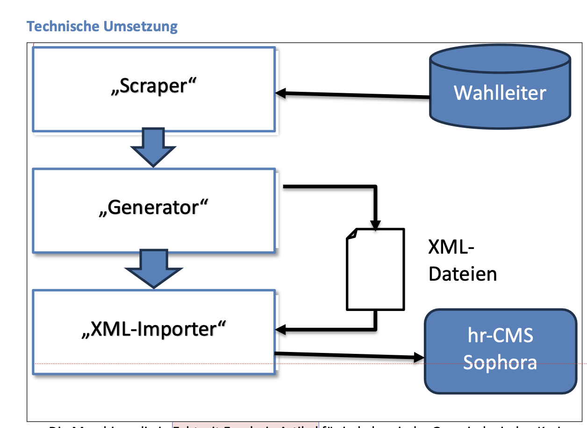

# #ltwhe23 

Wahlkreis-Ergebnisseiten nach jeweiligem Auszählungsstand - Projekt zur Landtagswahl in 
Hessen am 08.10.2023

## Beschreibung ##

Der Code aktualisiert ~950 Datawrapper-Grafiken - jeweils Erst- und Zweitstimmen für
Wahlkreise und Gemeinden sowie Zweitstimmen für die vier kreisfreien Städte Frankfurt, 
Kassel, Wiesbaden und Darmstadt - die jeweils mehr als einen Wahlkreis umfassen. (Offenbach
hat nur den einen und konnte deshalb wie eine normale Gemeinde behandelt werden; mit 
Stadt- und übergeordneten Wahlkreis-Daten.)

Die Wahldaten stammen von einem CSV des Landeswahlleiters, das über 23degrees angeboten wurde - 
individuell, um Missbrauch oder Überlast zu vermeiden - und das die Stimmen auf Landes- , Wahlkreis-,
Kreis-, -Gemeinde-, und Stimmbezirks-Ebene enthielt. Es wurde etwa alle 3 Minuten aktualisiert

### Das Problem

Mit der herkömmlichen API-Fernsteuerung Datawrapper-Grafiken kommt man hier nicht weiter - 
wenn man Änderungen an Daten oder Aussehen eingetragen hat, muss die Grafik idR neu publiziert
werden, was jeweils 5-10 Sekunden dauert. Zu lang!

Schneller ist die Lösung, die Datawrapper-Grafiken ihre Daten - und auch ihre Metadaten für
Titel, Erkärtext und Aussehen - live von einem Google Bucket ziehen zu lassen, das CORS-fähig ist
(was immer das genau bedeutet) und die entsprechenden Lasten abkann. 

Die Daten müssen dafür über ein CSV angeliefert werden, das auf dem Bucket liegt, 
dessen Adresse die Datawrapper-Grafik kennt, und das überschrieben wird, wenn etwas aktualisiert
werden soll. Details hier: https://academy.datawrapper.de/article/60-external-data-sources

### Lösung: CSV- und JSON-Livedaten in Datawrapper

Schöner ist die zusätzliche Möglichkeit, ein JSON mit zusätzlichen Metadaten-Keys zu hinterlegen, 
dessen Inhalt die Datawrapper-Grafik genau so zieht wie die Daten - zum Beipsiel für 
einen angepassten Titel, einen Fortschrittsbalken für die ausgezählten Stimmbezirke und einen
Zeitstempel. Alles für Trend-Visualisierung nach Auszählungsstand unabdingbar. 
https://academy.datawrapper.de/article/316-live-update-chart-with-json

Wenn die Grafiken nicht neu veröffentlicht werden müssen, sondern man nur die kleinen
CSV- und JSON-Dateien generieren und uploaden muss, ist ein Auswertungs-Zyklus in unter einer
Minute erledigt - auf jeden Fall schnell genug, um die nächste Aktualisierung mitzubekommen.

### Generierung und Anpassung der Datawrapper-Grafiken

Das Anlegen der Grafiken erfolgte automatisiert - wie auch sonst - , allerdings 
habe ich es für effizienter gehalten, nicht jeden einzelnen Key anzupassen, weil Datawrapper
zum Teil ganze Serien von Parametern braucht, um richtig zu antworten. (Beispiel: 
column-Parameter zum Umgang mit Datenreihen).

Workflow war also: 
- Anpassung von Muster-Datawrapper-Grafiken von Hand...
- ...ergänzt von automatisch generierten Farbtabellen für die Parteien
- Eintrag der CSV- und JSON-Datei-URLs automatisiert; Anpassung von Keys

### Datawrapper-Grafiken für Live-Update einrichten via API

Damit eine Grafik die externen Daten nutzt, muss man per API fünf(!) Keys eintragen - 
siehe Funktion fix_dwcdn() in der Datei aktualisiere_grafiken.R: 

```
    data$`use-datawrapper-cdn`<- FALSE
    data$`upload-method`= "external-data"
    data$`external-data` = "<dateiname>.csv"
    data$`external-metadata` = "<dateiname>.json"
    
    #...und wichtig: ein zusätzlicher Key auf der Ebene content
    dw_edit_chart(chart_id = did, data = data, externalData = ext_path)
```

## Drumherum ##

Die Datawrapper-Grafiken wurden in automatisch erzeugte und aktualisierte Sophora-
Artikel eingebunden - der Generator/Aktualisierer für diese Artikel war der eigentliche
Kern des Projekts. 



Ursprünglich war eine Aktualisierung der Sophora-Seiten nach Auszählungsstand geplant, 
die aber eine zu hohe Last auf dem Sophora-System erzeugt hatte, da der Import relativ 
aufwändig ist. So wurden die Artikel automatisiert angelegt (u.a. mit Hilfe der Index-
Tabelle mit Datawrapper-IDs und zugehörigen )